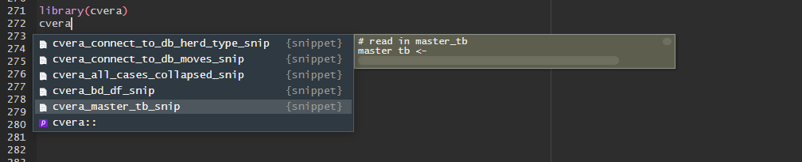
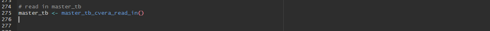
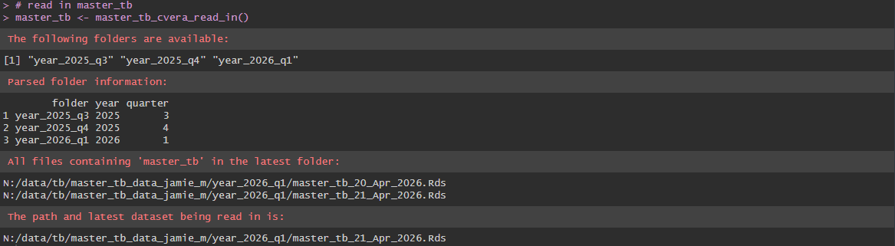

<!-- README.md is generated from README.Rmd. Please edit that file -->

```{r, include = FALSE}
knitr::opts_chunk$set(
  collapse = TRUE,
  comment = "#>",
  fig.path = "man/figures/README-",
  out.width = "100%"
)
```

# cvera

<!-- badges: start -->
<!-- badges: end -->

---

`cvera` is an R package with a collection of utility R functions, useful in exploring Irish bTB datasets collated in CVERA.

---

## Installation

You can install the development version of cvera from [GitHub](https://github.com/) with:

``` r
# install.packages("devtools")
devtools::install_github("j-madden-m/cvera")
```

Additionally install cvera specific **snippets**:

``` r
install_cvera_snippets()
```


## Automatically reading in the latest available data

Once snippets are installed, cvera related snippets can be accessed by starting to type "cvera":

```{r snippetscreenshot, echo = F, eval = T, include=T, warning = F, error=F, out.width="100%", out.width="100%", fig.cap = "cvera snippets"}
 #works in chunk but not when you render
#knitr::include_graphics(path.expand("~/data/historic_gif_eamonn.png"))
```

### master_tb (herd-level skin testing data)

E.g. clicking `cvera_master_tb_snip` will automatically populate the following code:


```{r snippetscreenshotmastertb, echo = F, eval = T, include=T, warning = F, error=F, out.width="100%", out.width="100%", fig.cap = "master_tb snippets"}
 #works in chunk but not when you render
#knitr::include_graphics(path.expand("~/data/historic_gif_eamonn.png"))
```

which reads in the most recent `master_tb` dataset and gives details of latest file name, date etc:


```{r snippetscreenshotmastertbconcole, echo = F, eval = T, include=T, warning = F, error=F, out.width="100%", out.width="100%", fig.cap = "Console output"}
 #works in chunk but not when you render
#knitr::include_graphics(path.expand("~/data/historic_gif_eamonn.png"))
```


Or manually reading it in using `master_tb_cvera_read_in` function:

```{r reading_in_master_tb, include = T, warning = FALSE, eval = FALSE}
library(cvera)
my_master_tb_dataset <- master_tb_cvera_read_in()
```


### bd_df (breakdown dataset)

Use snippet `cvera_bd_df_snip` to produce:

```{r reading_in_bd_df, include = T, warning = FALSE, eval = FALSE}
# read in bd_df
bd_df <- bd_df_read_in()
```


### all_cases_collapsed (animal-level bTB cases dataset)

Use snippet `cvera_all_cases_collapsed_snip` to produce:


```{r reading_in_all_cases, include = T, warning = FALSE, eval = FALSE}
# read in all_cases_collapsed
all_cases_collapsed <- all_cases_collapsed_read_in()
```


### connect to AIM movement database

Once a connection is made to the SQL AIM database (once off set up), run the following snippet to access sample code to query moves: `cvera_connect_to_db_moves_snip`


## Updated interactive herd plot:

Once all three datasets are read in, a herd-level plot can be created: 


```{r herd_plot_out, eval = F, echo = T}
herd_plot("x1234567") #fake herd
```


We can include raw data for the herd in the output

```{r herd_plot_out_with_tables, eval = F, echo = T}
# include tables
herd_plot("x1234567", include_tables = TRUE) #fake herd
```


```{r herdplotfigure, echo = F, eval = F, include=F, warning = F, error=F, out.width="100%", out.width="100%", fig.cap = "Herd plot"}
knitr::include_graphics("data/herd_plot_figure_2.png") #works in chunk but not when you render
#knitr::include_graphics(path.expand("~/data/historic_gif_eamonn.png"))
```


## Check if BD occured during particular years

```{r bd_during_test, eval = F, echo = T}
bd_df <- bd_during_year(bd_df, years_to_check = c(2005:2006))
```

## Helper function to select core variables
```{r core_select_test, eval = F, echo = T}
master_tb %>%
 filter(total_reactor_skin > 10) %>%
 core_vars()
```

## Create indicator variable if herd had BD within e.g. 365 days prior to current one

```{r bd_within_time_period_test, eval = F, echo = T}
bd_df <- bd_within_time_period(bd_df, 2016, 730)
```
