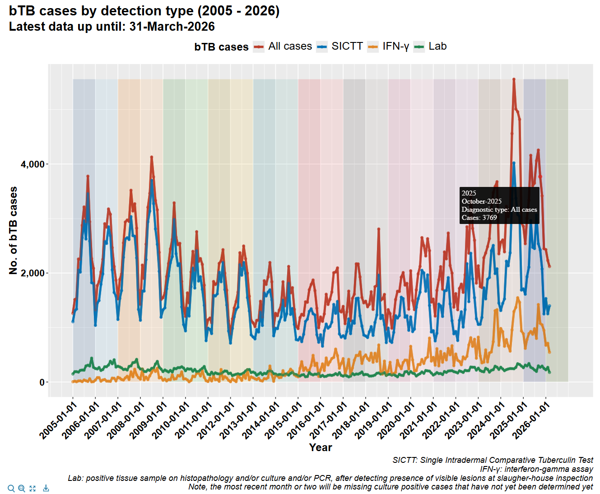

<!-- README.md is generated from README.Rmd. Please edit that file -->

# cvera

<!-- badges: start -->

<!-- badges: end -->

------------------------------------------------------------------------

`cvera` is an R package with a collection of utility R functions, useful
in exploring Irish bTB datasets collated in CVERA.

------------------------------------------------------------------------

## Installation

You can install the development version of cvera from
[GitHub](https://github.com/) with:

``` r
# using devtools
# install.packages("devtools")
devtools::install_github("j-madden-m/cvera")

# or

# using pak <https://pak.r-lib.org/index.html>
# install.packages("pak")
pak::pak("j-madden-m/cvera")
```

Additionally install cvera specific **snippets** (note, this currently
only works in `RStudio` (\> version 1.3), not currently implemented for
`Positron`):

``` r
library(cvera)
install_cvera_snippets()
```

This appends cvera snippets to your snippets file.

## Automatically reading in the latest available data (with access to server)

Once snippets are installed, cvera related snippets can be accessed by
starting to type “cvera”:


### master_tb (herd-level skin testing data)

E.g. clicking `cvera_master_tb_snip`, this will automatically populate
the following code:


which reads in the most recent `master_tb` dataset and gives details of
latest file name, date etc:


Or manually reading it in using `master_tb_cvera_read_in` function:

``` r
my_master_tb_dataset <- master_tb_cvera_read_in()
```

### bd_df (breakdown dataset)

Use snippet `cvera_bd_df_snip` to produce:

``` r
# read in bd_df
bd_df <- bd_df_read_in()
```

### all_cases_collapsed (animal-level bTB cases dataset)

Use snippet `cvera_all_cases_collapsed_snip` to produce:

``` r
# read in all_cases_collapsed
all_cases_collapsed <- all_cases_collapsed_read_in()
case_count_time_series()
```

This additionally includes the line: `case_count_time_series()` which
automatically plots the most recent data:



### connect to AIM movement database

Once a connection is made to the SQL AIM database (once off set up), run
the following snippet to access sample code to query moves:
`cvera_connect_to_db_moves_snip`

## Updated interactive herd plot:

Once all three datasets are read in, a herd-level plot can be created:

``` r
herd_plot("x1234567") #fake herd
```

We can include raw data for the herd in the output

``` r
# include tables
herd_plot("x1234567", include_tables = TRUE) #fake herd
```

## SICTT table definitions

Simply returns a table of all skin test types along with test type code,
name and an explanation of each test.

``` r
test_types_sictt_table()
```

## Check if BD occured during particular years

``` r
bd_df <- bd_during_year(bd_df, years_to_check = c(2005:2006))
```

## Helper function to select core variables

``` r
master_tb %>%
 filter(total_reactor_skin > 10) %>%
 core_vars()
```

## Create indicator variable if herd had BD within e.g. 365 days prior to current one

``` r
bd_df <- bd_within_time_period(bd_df, 2016, 730)
```
